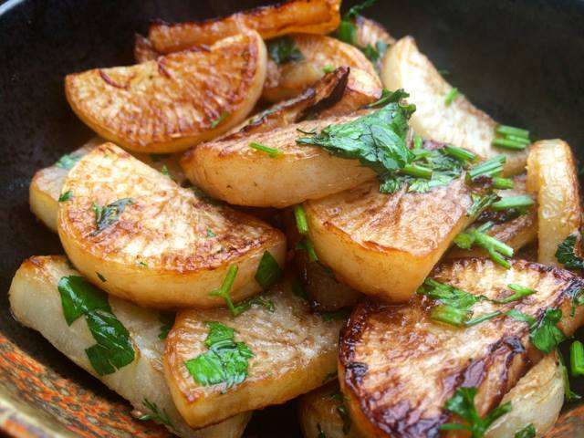
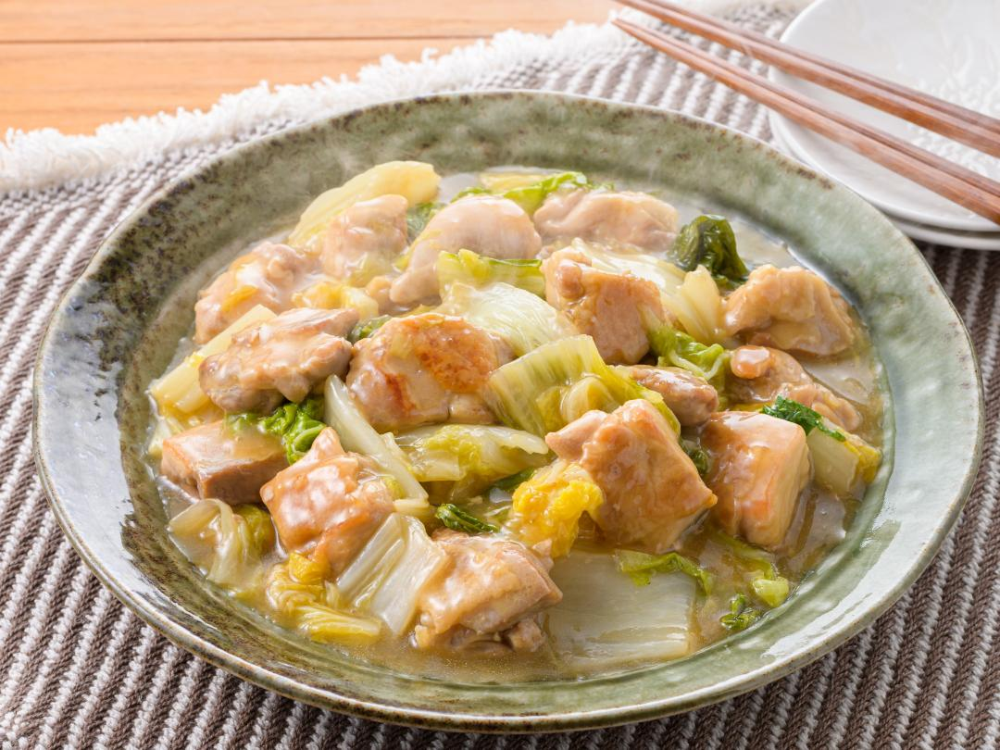
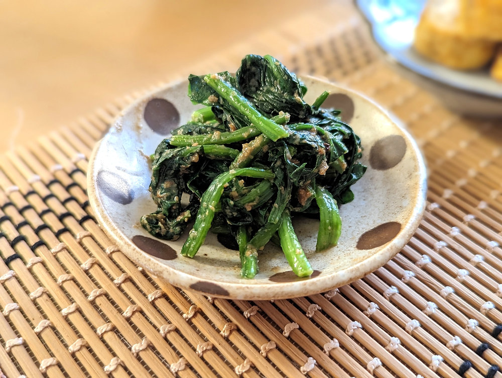

# Data Science Toolbox

### Recipe
1. Pan-fried honey-soy sauce radish
2. Yuzu-pepper chicken
3. Sesame spinach
4. Miso soup

- Preparing Time : **2 hours**
- Expense: **20 CAD/person**
- Meal type: **Dinner**

 

